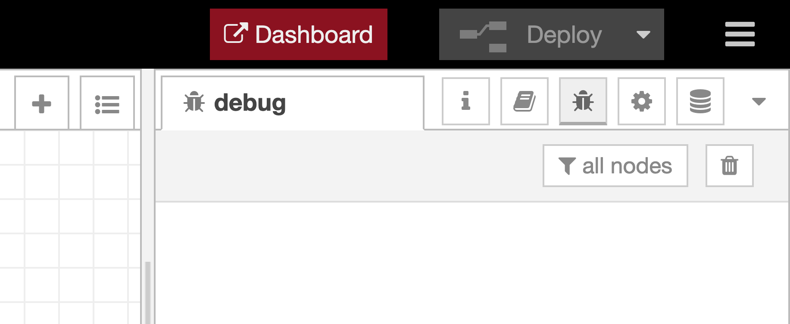

# node-red-contrib-plugin-header
Custom header UI for Node-RED flow editor

**Requires Node-RED 1.3 or later.**

To open the Node-RED dashboard, this plugin provides button UI on the header area of the Node-RED flow editor.

Install
-------

Run the following command in your Node-RED user directory - typically `~/.node-red`

        npm install node-red-contrib-plugin-header

After the installing this plugin, you can see the dashboard button on the Node-RED flow editor. 

